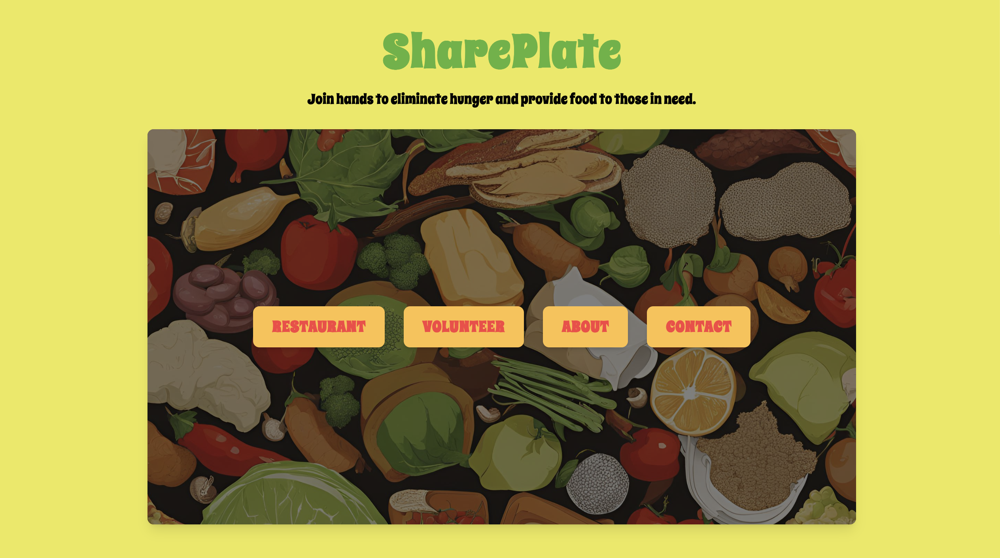
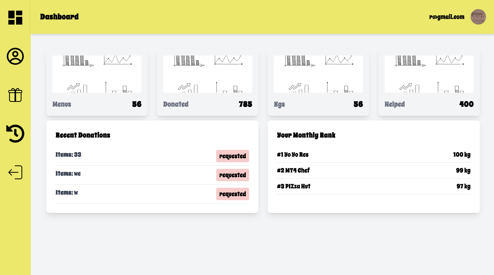
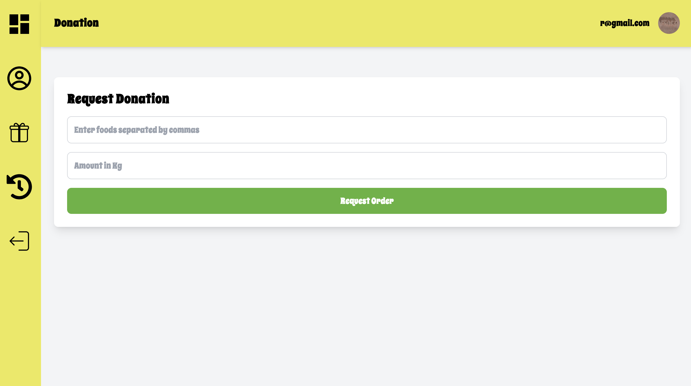
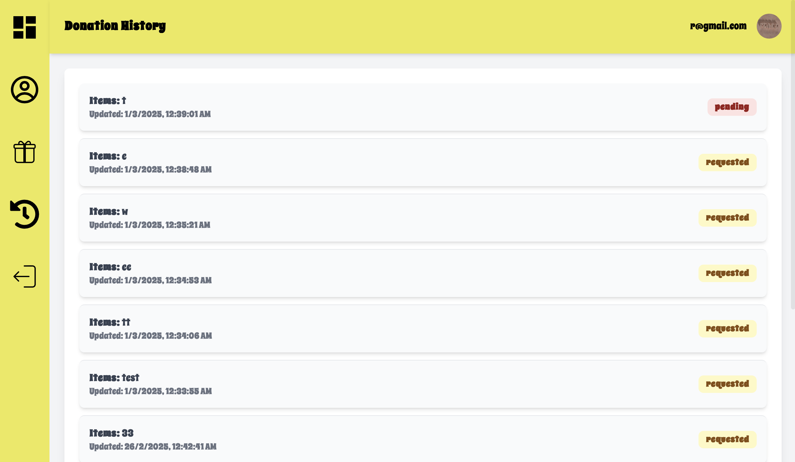
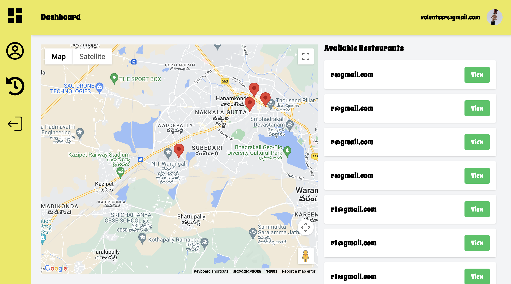
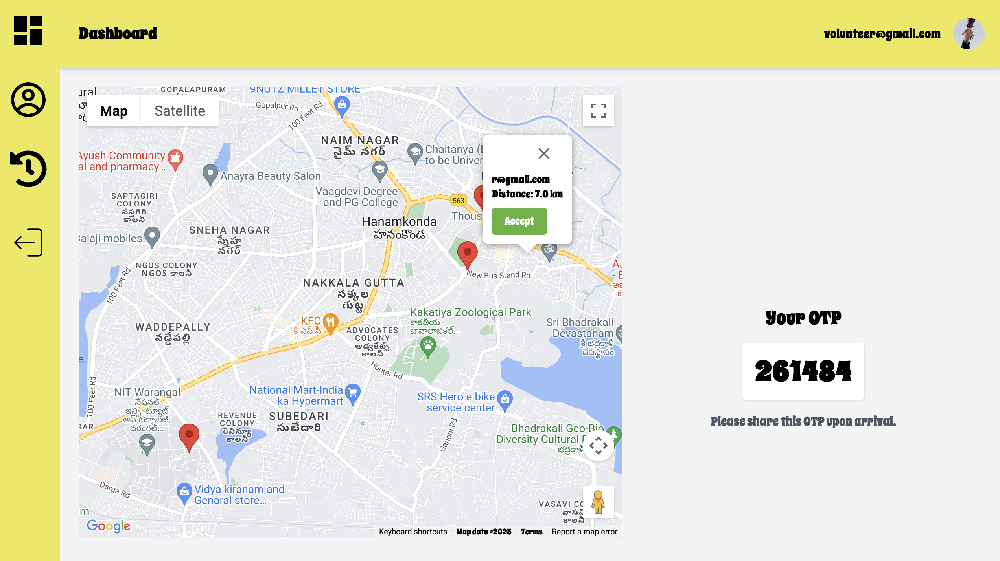
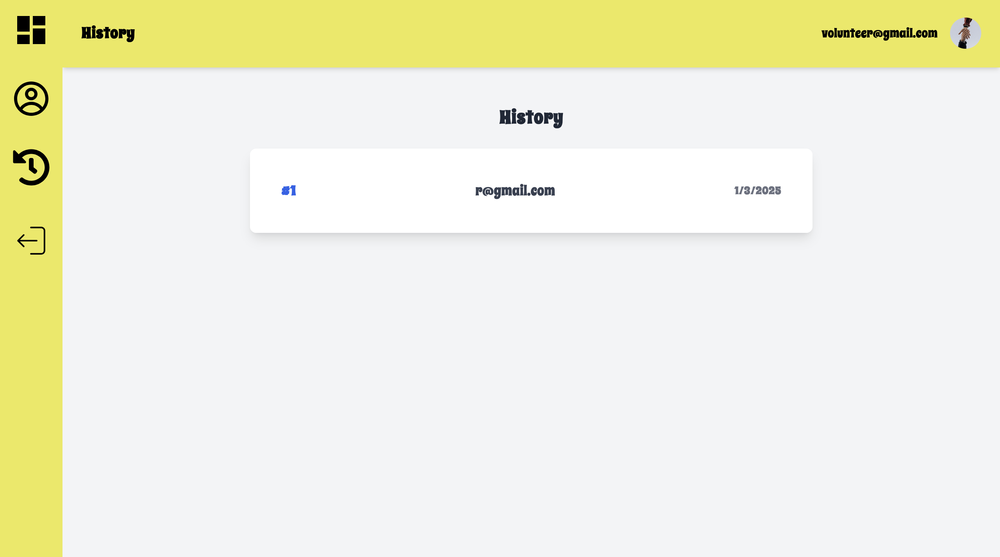
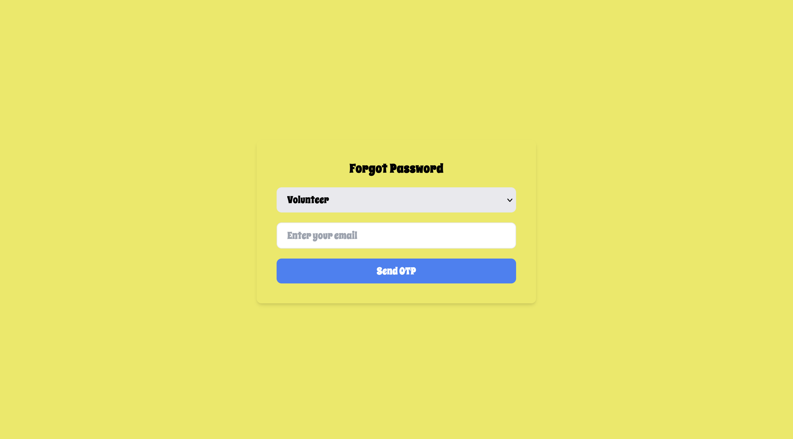

RescueFood App

Overview

RescueFood is a web-based platform that connects restaurants with volunteers to facilitate food donation and reduce food waste. Restaurants can create donation requests, and nearby volunteers can view and respond to these requests in real time.

Features

Real-time Donations: Restaurants can list excess food for donation, which is immediately visible to nearby volunteers.

Geolocation-based Matching: Volunteers within a 20km radius receive live donation requests.

Socket.IO Integration: Ensures seamless real-time updates of donation requests.

Interactive Map: Displays donation locations with Google Maps integration.

User Authentication: Secure login for restaurants and volunteers.

Database Management: MongoDB for storing donation requests and volunteer details.

Tech Stack

Frontend: ReactJS, Tailwind CSS

Backend: Node.js, Express.js, MongoDB

Real-time Communication: Socket.IO

Maps & Geolocation: Google Maps API

SMTP Server: For OTP service

Installation

Prerequisites

Node.js (>=19.x)

MongoDB

Steps

Clone the Repository

git clone https://github.com/sh78ba/rescuefood.git

Set Up Environment Variables
Create a .env file and configure:

MONGO_URI=your_mongodb_uri
REACT_APP_MAP_API="Your API Key"

Run the Backend

cd backend
npm install
node server.js

Run the Frontend

cd frontend/rescuefood
npm install
npm start

Usage

Restaurant: Log in and create a donation request with food details and location.

Volunteer: Log in to view available donations and accept a request.

Live Updates: See new donation requests in real time on the interactive map.

Images:

Landing Page

Restaurant

 
 

Volunteer

 
 

Others

